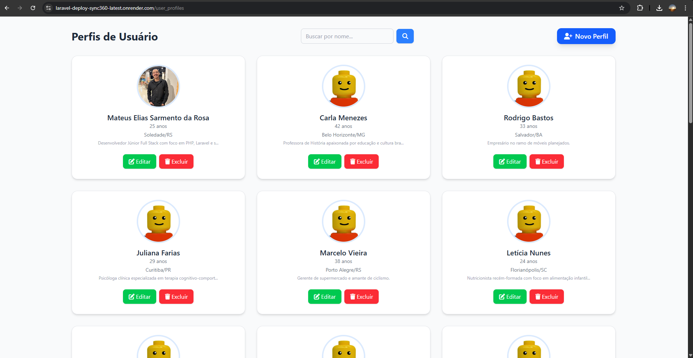
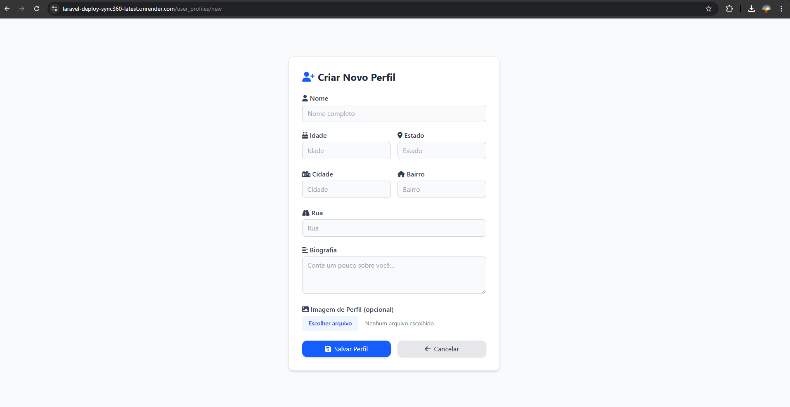
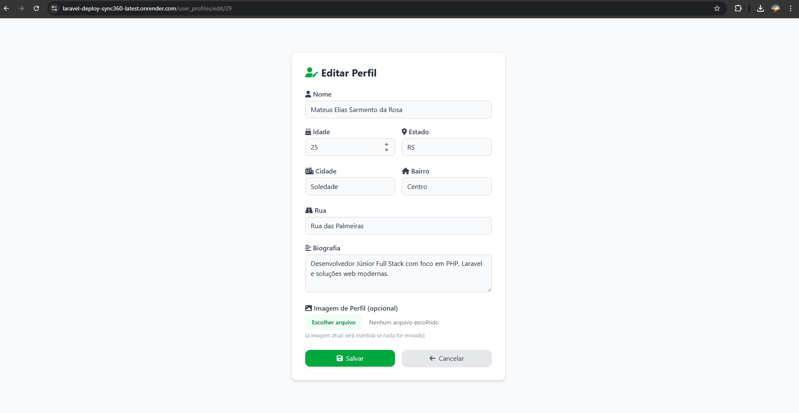
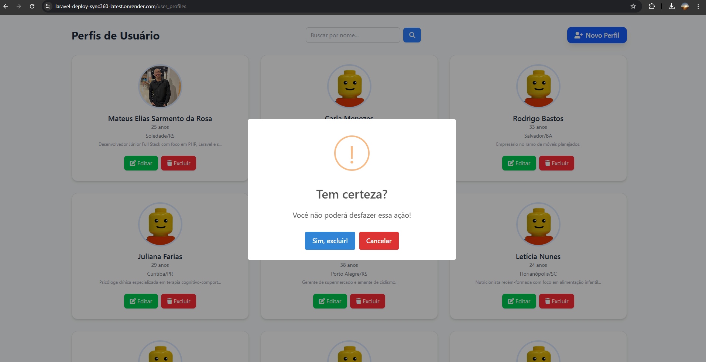
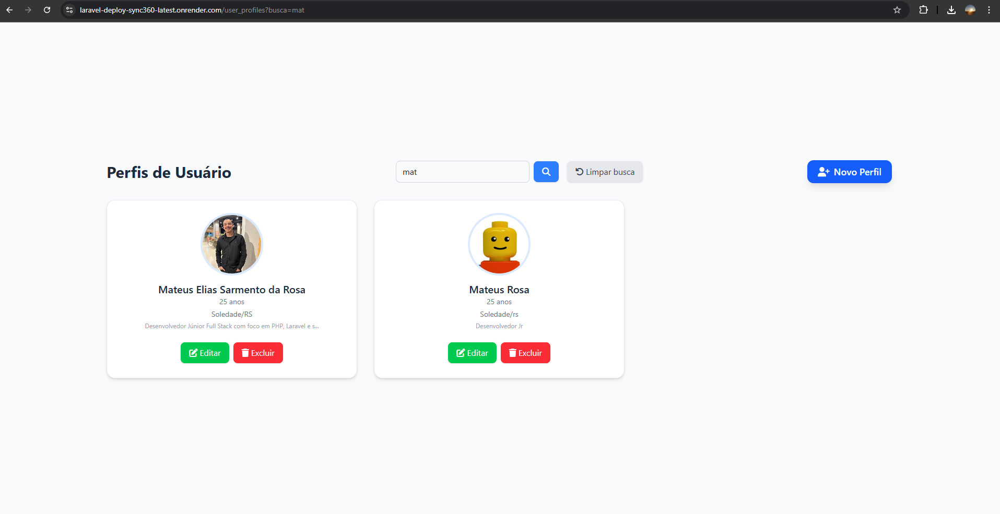

# User Profile Sync 360

**Desafio Técnico – Sync360**  
[🔗 Acesse o projeto online](https://laravel-deploy-sync360-latest.onrender.com/user_profiles)

---

## ✨ Visão Geral

O **User Profile Sync 360** é uma aplicação web fullstack desenvolvida como parte do processo seletivo da Sync360. Ela permite o cadastro, edição, listagem e exclusão de perfis de usuários com imagem, tudo armazenado em banco de dados MySQL.

O projeto foi feito com **Laravel 12** (estrutura MVC), views em **Blade**, estilização com **TailwindCSS** e build com **Vite**, além de responsividade total e feedback visual com SweetAlert2.

---

## 📸 Prints das Telas

### 🖥️ Tela Desktop


### 📱 Tela Mobile


### ➕ Formulário de Criação


### ✏️ Tela de Edição


### ✏️ Tela de Exclusão


###  Filtro de Pesquisa (SweetAlert)


---

## 🚀 Funcionalidades

- 🔎 Busca por nome entre perfis
- ➕ Cadastro de novo perfil
- ✏️ Edição de perfil existente
- 🗑️ Exclusão com confirmação
- 🖼️ Upload de imagem de perfil
- 📱 Interface 100% responsiva
- ✅ Feedback visual (Animações, erros, etc.)

---

## ✅ Validações e Boas Práticas

- Todos os campos obrigatórios validados
- Upload de imagem validado (extensão e tamanho)
- Mensagens de erro e sucesso com SweetAlert2
- Estrutura clara com uso de controllers, models e views
- Organização em padrões Laravel MVC

---

## 🛠️ Tecnologias Utilizadas

- **Backend:** PHP 8.2+, Laravel 12.x
- **Frontend:** Blade + TailwindCSS + JavaScript
- **Build:** Vite + Laravel Vite Plugin
- **Banco de Dados:** MySQL
- **Outros:** SweetAlert2, FontAwesome

---

## 🔗 Rotas Principais

| Método | Rota                          | Descrição                 |
|--------|-------------------------------|---------------------------|
| GET    | `/user_profiles`              | Lista todos os perfis     |
| GET    | `/user_profiles/new`          | Formulário de novo perfil |
| POST   | `/user_profiles/new`          | Salvar novo perfil        |
| GET    | `/user_profiles/edit/{id}`    | Editar perfil existente   |
| POST   | `/user_profiles/edit`         | Atualizar perfil          |
| DELETE | `/user_profiles/delete/{id}`  | Excluir perfil            |

---

## 🗂️ Estrutura de Pastas

- `app/Http/Controllers/` — Controladores
- `app/Models/` — Modelos Eloquent
- `resources/views/` — Views Blade
- `routes/web.php` — Definição de rotas
- `database/migrations/` — Migrações do banco
- `public/` — Arquivos públicos (imagens, build do Vite)

---

## 🧩 Modelo de Dados

### UserProfile

| Campo          | Tipo    | Descrição             |
|----------------|---------|-----------------------|
| `nome`         | string  | Nome completo         |
| `idade`        | int     | Idade                 |
| `rua`          | string  | Rua                   |
| `bairro`       | string  | Bairro                |
| `cidade`       | string  | Cidade                |
| `estado`       | string  | Estado                |
| `biografia`    | text    | Descrição pessoal     |
| `imagem_perfil`| string  | Caminho da imagem     |

---

## 🖥️ Como rodar localmente

```bash
# 1. Clone o repositório
git clone https://github.com/seu-usuario/user_profile_sync360.git
cd user-profile-sync-360

# 2. Instale as dependências PHP
composer install

# 3. Instale dependências JS
npm install

# 4. Configure o ambiente
cp .env.example .env
php artisan key:generate

# 5. Configure o banco no .env e execute as migrações
php artisan migrate

# 6. (Opcional) Popule o banco
php artisan db:seed

# 7. Rode o frontend e backend localmente
npm run dev
php artisan serve
```

---

## 🚀 Deploy (Render)

O projeto foi publicado em ambiente Docker via Render:

- `public/build` está versionado
- Ambiente `.env` configurado via painel Render
- `storage:link` e `migrate` são executados em `start.sh`
- Build do Vite feito localmente antes do push

---

## 👨‍💻 Autor

Desenvolvido por **Mateus Elias Sarmento da Rosa**  
✉️ <mateusesr1@gmail.com>  
🔗 [LinkedIn](https://www.linkedin.com/in/mateuseliasdev)

---

## 📄 Licença

Este projeto é open-source e pode ser utilizado para fins de estudo e aprendizado.

---